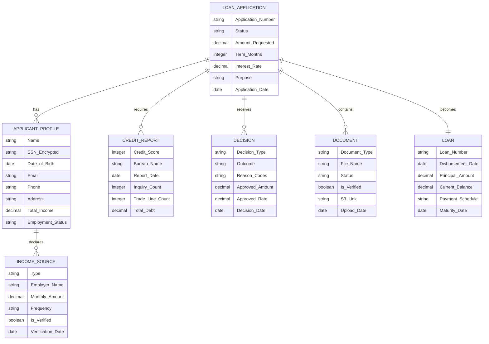

# Lending Platform - Object Model Documentation

## Object Model Diagram

## Object Descriptions

### 📋 **Loan_Application__c**
The central object that represents a customer's loan application request. It captures the initial loan details including requested amount, purpose, and term, and serves as the parent record that connects all other aspects of the lending process from origination through decision.

### 👤 **Applicant_Profile__c**
Stores comprehensive borrower information including personal details, contact information, and demographics. This custom object is used instead of Person Accounts to maintain full control over the data model and avoid standard Salesforce account/contact complexity. It maintains PII (Personally Identifiable Information) with appropriate encryption for sensitive fields like SSN, and serves as the master record for all applicant-related data.

### 💰 **Income_Source__c**
Tracks individual income streams for each applicant, supporting multiple income types such as employment, self-employment, investments, or benefits. Each record includes verification status and amounts, which roll up to provide a complete financial picture of the applicant's ability to repay.

### 📊 **Credit_Report__c**
Captures credit bureau data including scores, trade lines, and inquiry counts from external credit reporting agencies. This object stores point-in-time snapshots of credit information used for underwriting decisions and maintains the full credit history for compliance and audit purposes.

### ✅ **Decision__c**
Records all underwriting decisions made on a loan application, including approvals, denials, and conditional approvals. It captures decision rationale through reason codes, approved terms if different from requested, and maintains a complete audit trail for regulatory compliance.

### 🏦 **Loan__c**
Represents an active loan account created after an approved application is funded. This object tracks the loan lifecycle post-disbursement including current balance, payment schedule, and maturity information. Since loan servicing is out of scope for this POC, detailed payment tracking is not included.

### 📄 **Document__c**
Manages all documents collected during the application and servicing lifecycle, including identity verification, income documentation, and legal agreements. Each record includes metadata for document type, verification status, and secure links to document storage, supporting both compliance requirements and operational workflows.

## Key Relationships

- **Master-Detail Relationships:**
  - Loan Application → Applicant Profile (1:M) - An application can have multiple applicants (primary, co-borrower)

- **Lookup Relationships:**
  - Income Source → Applicant Profile - Links income to specific applicants
  - Credit Report → Loan Application - Associates credit pulls with applications
  - Decision → Loan Application - Links underwriting decisions to applications
  - Document → Loan Application - Connects supporting documents to applications
  - Loan Application → Loan - Links the approved application to the resulting loan account

## Important Design Decisions

- **Applicant_Profile__c vs Person Accounts:** We're using a custom Applicant_Profile__c object instead of Salesforce Person Accounts to maintain full control over the data model, avoid account/contact complexity, and simplify the POC implementation.

- **Loan Servicing Scope:** Payment tracking and loan servicing functionality is excluded from this POC. The Loan__c object represents funded loans but detailed payment management is out of scope.

This object model supports the lending lifecycle from application through funding decision, with appropriate data segregation for security and clear relationships for reporting and automation.